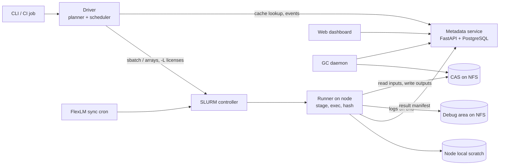
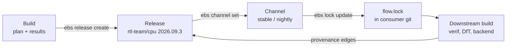

# EDA Grid Build System — Architecture & Design Plan

Sep 24, 2026 · Hugo

The plan: build a thin, open-source orchestrator (Apache-2.0) that owns the EDA-specific parts: the flow format, action hashing, license-aware SLURM dispatch, team releases and provenance. Everything underneath is proven infrastructure: SLURM, NFS, PostgreSQL, bubblewrap, SHA-256 and in-toto. v1 targets Questa RTL simulation and lint for a 32-core RISC-V CPU, used by about 100 engineers and by CI.

## Context and goals

**Workload in v1.** Thousands of Verilog/SystemVerilog modules. Questa compile/optimize/simulate, with regressions of about 1,000+ tests per full run, plus lint. Existing Makefile and Tcl flows must be wrappable on day one.

**Scale.** About 100 concurrent users across RTL, verification, DfT and backend. A large SLURM grid, an NFS server, and fast local disks on the nodes. Later flows (synthesis, P&R) produce artifacts of 100+ GB.

**Goals**

1. **Reuse over recompute.** A step reruns only when its hashed inputs change. Results are shared across users and CI through a common cache.
2. **Reproducibility.** Every build records a fully expanded plan: all parameters, input digests, tool versions and environment. A sign-off build can be re-validated years later.
3. **Asynchronous teams.** Each team publishes versioned releases of its outputs and chooses which upstream releases to consume.
4. **Provenance.** Any artifact (up to a future GDS) can be traced back to its RTL commit, tool versions and the tests that ran on it.
5. **Grid-native.** Dispatch to SLURM with license awareness and team priorities. Debug logs come back to NFS, and node scratch is cleaned.
6. **CLI first**, a web dashboard second, CI integration third.

**Non-goals for v1:** QoR tracking, synthesis and P&R rule packs, schedulers other than SLURM (they are designed for but not built), archiving tool binaries, and cloud bursting.

## Key design decisions

| Area | Decision | Why |
| --- | --- | --- |
| Core | Custom orchestrator in Python 3.11+, built on standard components | EDA users and your internal tools already use Python. The novel logic (licenses, releases, EDA hashing) is ours; the plumbing is not |
| Flow format | Declarative YAML plus CSV/YAML parameter tables, validated by JSON Schema; Python plugins for new step kinds | Easy to write and review. Every build stores the fully expanded plan, so each parameter is explicit |
| Graph | Static DAG, expanded before the run | Matches your flows. It enables `plan` / dry-run and exact cost estimates |
| Cache model | Input-addressed action keys (like Bazel/Nix), shared action cache, content-addressed store (CAS) | Reruns only what changed. Cache hits work across users and CI |
| Digests | SHA-256 with an algorithm prefix (`sha256:…`), BLAKE3 optional | Hardware-accelerated, and interoperable with OCI, REAPI and in-toto |
| Nondeterministic tools | Per-output `deterministic: false` makes downstream keys use the producer's action key, not the output bytes | Questa work libraries and timestamps must not break downstream caching |
| Storage | CAS on NFS (fs backend), node-local scratch for execution, pluggable S3 backend later | Uses your existing storage. GitLab packages cap at 5 GB each, so they are unsuitable for a CAS |
| Metadata | PostgreSQL: builds, actions, action cache, releases, provenance graph, GC leases | Stable, transactional, easy to query for provenance |
| Execution | The driver runs as the user (CLI or a SLURM "driver job"). Tasks run via `sbatch`, job arrays for regressions, `sacct`/`squeue --json` for status | Jobs keep the user's identity, NDA group permissions and fair-share. No root service |
| Licenses | Native SLURM licenses (`-L`), remote licenses via `sacctmgr`, `LastConsumed` synced from FlexLM. Team priority via SLURM accounts and QOS | Jobs never start and then block on a license; priorities use SLURM's own tools |
| Toolchains | Registered module snapshots: module name + version + install-tree fingerprint + captured env | Tool install paths (UVM, VIPs) become hashed, declared inputs |
| Sandbox | v1: strict staging of declared inputs with a scrubbed env. v2: bubblewrap namespaces with read-only tool trees. strace "discover" mode for migration | Hermeticity arrives in phases, without root |
| Versioning | Immutable builds → team releases → channels. `flow.lock` committed to git. SLSA/in-toto provenance per release | Teams work asynchronously, and releases are reproducible and auditable |
| GC | Last-access tracking in Postgres, releases pin artifacts as GC roots, TTL + quota eviction per domain | Bounded storage with no dangling releases |
| Confidentiality | "Domains" (NDA scopes): separate CAS roots, Unix groups, scoped cache lookups | Prevents cross-NDA data leaks through the cache |
| License | Apache-2.0 | Includes a patent grant; corporate-friendly for EDA vendors and users |

## Alternatives considered

No existing engine covers license-aware SLURM dispatch, a shared cache partitioned by NDA scope, and team releases together. We therefore build the orchestration layer ourselves and reuse proven parts beneath it.

| Option | Strengths | Blockers for this use |
| --- | --- | --- |
| Bazel + REAPI (Buildbarn, BuildBuddy) | Best-in-class hashing, sandboxing and remote cache; very battle-tested | No production SLURM executor. 100 GB outputs flow through gRPC and client downloads. Starlark is a steep learning curve for hardware engineers. Licenses and team priorities aren't modeled |
| [Snakemake](https://snakemake.readthedocs.io/en/stable/executing/caching.html) | SLURM plugin; cross-workflow cache hashes steps, params and inputs as a Merkle tree | The cache is marked experimental and is readable by all users (no NDA scoping). No releases or provenance model |
| Nextflow | Very mature on HPC with SLURM; `-resume` hashing | The cache is per work directory, not shared across 100 users. Groovy DSL. No release model |
| Make + wrappers | Zero migration | Timestamp-based, no shared cache, no provenance |
| **Custom core on standards (chosen)** | EDA-specific semantics; reuses SLURM, Postgres, NFS, bubblewrap, SHA-256 and in-toto | We own the DAG and cache logic (a modest amount of code); it needs a solid test suite |

We keep an exit path: the CAS layout and digests are REAPI-compatible, so a Buildbarn or bazel-remote backend can be added later without changing action keys.

## System architecture

Orchestration runs as the user, state is shared, and compute is SLURM's. A per-build **driver** plans, checks the cache and submits jobs. A small **metadata service** holds shared state. A **runner** on each compute node stages, executes, hashes and uploads.



The driver sends work to SLURM, and runners write artifacts to the NFS CAS and report results to the metadata service, which the dashboard and GC read.

| Component | Responsibility | Runs as / where |
| --- | --- | --- |
| CLI (`ebs`, EDA Build System) | `plan`, `build`, `status`, `logs`, `debug`, `reproduce`, `release`, `why`, `gc` | User, on login node or laptop |
| Driver | Loads the flow, expands tables, computes action keys bottom-up, queries the action cache, submits ready actions, handles retries, streams events | User process; `--detach` resubmits it as a small SLURM job so long regressions survive logout |
| Runner | Resolves the input manifest, stages inputs to local scratch (small files copied, large ones bind-mounted read-only), sets the toolchain env, runs the command, hashes outputs, uploads them atomically to the CAS, copies debug files, cleans scratch | User, inside the SLURM job |
| Metadata service | Action cache, builds, releases, provenance graph, GC leases, authz; REST API plus an event stream for the dashboard | Service account, HA Postgres |
| CAS | Immutable blobs and directory trees by digest, one root per confidentiality domain | NFS export, group-restricted |
| GC daemon | Mark (roots = releases, pinned builds, live leases) and sweep by TTL and quota | Service account with domain group membership |
| FlexLM sync | Cron job that runs `lmstat` and updates SLURM remote-license `LastConsumed` | Admin |

In v1, a cache hit costs one Postgres round-trip; no data moves until a consumer needs it.

## Flow description format

Flows are YAML files (`flow.yaml`) checked into each team's git repo. Parameter tables are CSV or YAML files next to them. `ebs plan` writes the fully expanded, explicit plan, and that plan is stored with every build.

**Concepts**

- **Toolchain:** a registered tool environment (module + version), with its license features and default resources.
- **Step:** a command template with declared `inputs`, `outputs`, `params`, `resources` and `licenses`. `kind` picks a rule implementation (`shell`, `make`, `questa.compile`, `questa.sim`, or a Python plugin).
- **Matrix:** expands a step over the rows of a table (a cross product or a zip), so each row becomes one action.
- **Import:** consumes another team's release by channel or version, pinned in `flow.lock`.

```yaml
version: 1
project: rv32x-cpu
domain: cpu-nda            # confidentiality domain

imports:
  rtl: { from: rtl-team/cpu, channel: stable }   # pinned in flow.lock

toolchains:
  questa:   { module: questa/2025.2, licenses: { msimhdlsim: 1 } }
  spyglass: { module: vc_spyglass/2025.06, licenses: { vcspyglass: 1 } }

steps:
  compile:
    kind: questa.compile
    toolchain: questa
    matrix: { table: libs.csv }                 # one action per library: lib, filelist
    inputs:
      srcs: "${imports.rtl}/**/*.sv"
      filelist: "${imports.rtl}/${row.filelist}"
    params: { lib: "${row.lib}", vlog_opts: "-sv -timescale 1ns/1ps" }
    outputs: { worklib: { dir: "work/${row.lib}", deterministic: false } }
    resources: { cpus: 2, mem: 8G, time: 30m }

  elab:
    kind: questa.opt
    toolchain: questa
    inputs: { libs: "${steps.compile.outputs.worklib[*]}" }
    params: { top: tb_top }
    outputs: { model: { dir: opt, deterministic: false } }

  sim:
    kind: questa.sim
    toolchain: questa
    matrix: { table: tests/regression.csv }     # test, seed, plusargs, timeout
    inputs: { model: "${steps.elab.outputs.model}" }
    params: { test: "${row.test}", seed: "${row.seed}", plusargs: "${row.plusargs}" }
    outputs: { result: result.json, cov: { file: cov.ucdb, optional: true } }
    debug: { collect: ["transcript", "*.log"], max_size: 2G }
    resources: { cpus: 1, mem: 4G, time: "${row.timeout}" }

  lint_legacy:                                  # wraps an existing Makefile as-is
    kind: make
    workdir: flows/lint
    target: lint
    inputs: { rtl: "${imports.rtl}/**", flow: "flows/lint/**" }
    outputs: { reports: { dir: reports/lint } }
    toolchain: spyglass
```

**Explicitness rules**

1. Seeds are table values, never generated implicitly. `ebs seeds gen` writes them into the table.
2. Only declared env vars (`env:`) reach the tool. Everything else is scrubbed.
3. The resolved plan (`plan.json`) records every action with its expanded command, params, input digests, toolchain fingerprint and action key. `ebs plan --diff <build>` shows exactly why an action will rerun.
4. `flow.lock` pins imports to exact release digests. It changes only through `ebs lock update`, reviewed like code.

**Legacy wrapping.** A `make` or `tcl` step treats the whole workdir and its declared globs as inputs and the declared dirs as outputs: coarse, but cached from day one. `ebs discover <step>` runs the step once under strace and proposes the inputs it actually read, so teams can tighten or split the step later.

## Hashing, action keys and caching

An action reruns only if its **action key** changes. The key is a SHA-256 over a canonical JSON document of everything that can affect the result, and nothing else.

```latex
\mathrm{key} = \mathrm{SHA256}(\mathrm{canon}(\mathrm{rule\_version},\ \mathrm{command},\ \mathrm{params},\ \mathrm{env}_{declared},\ \mathrm{toolchain\_id},\ \{\mathrm{path} \mapsto \mathrm{input\_id}\}))
```

| Included in the key | Excluded from the key |
| --- | --- |
| Rule implementation version and expanded command line | CPUs, memory, walltime, partition, SLURM job id |
| All params (lib, top, test, seed, plusargs, options) | User, timestamps, absolute build paths (actions see normalized paths) |
| Declared env vars | License server address (`LM_LICENSE_FILE`) |
| Toolchain id = module + version + install-tree fingerprint + captured env | Node CPU/OS (enforced instead with SLURM `--constraint` on an OS-image feature) |
| Input ids per logical path (files, trees, imported releases) | Undeclared files (invisible in the sandbox) |

**Input ids.** A file's id is the digest of its content. A directory's id is the digest of a Merkle tree manifest (sorted entries: name, mode, digest), which is REAPI-compatible. Rerun decisions always compare content digests, never timestamps. mtime is only an optimization hint that lets an unchanged file skip rehashing, via a stat cache keyed by `(path, size, mtime, inode)`, like the git index, so a re-plan over thousands of RTL files takes seconds.

**Why a stale stat cannot cause a wrong build.** NFS attribute caching, coarse timestamps and clock skew can make a modified file look unchanged. Five guards close that gap:

1. **Git-tracked sources use git's own blob ids.** `git ls-files -s` and `git status` supply content ids for clean files, so the stat cache never decides for them.
2. **Racy-clean rule (as in git):** a stat entry whose mtime is within a few seconds of when it was recorded is treated as dirty and rehashed. The stat key also includes ctime (nanoseconds), device and inode.
3. **Snapshot at plan time:** declared sources are copied into the CAS when the plan is made. Nodes execute on those exact bytes, never on the live NFS path, so a file edited during a build can't leak in.
4. **Strict mode:** `--rehash` ignores the stat cache entirely. It is on by default for CI and release builds, and for any file on a mount listed as untrusted.
5. **Verification:** the runner re-checks input digests before executing, and a sampled audit rehashes a small percentage of stat-cache hits each build and reports any mismatch.

**Nondeterministic outputs.** Questa work libraries embed timestamps, so their bytes differ run to run. An output marked `deterministic: false` passes the *producer's action key* downstream as its id (input-addressing). Downstream cache hits stay stable, and the stored bytes are simply whichever run landed first. Deterministic outputs pass their content digest, which gives **early cutoff**: a comment-only RTL change that yields an identical normalized lint report stops propagating there.

**Toolchains.** `ebs toolchain register questa/2025.2` loads the module once in a clean shell, captures the resulting env, records the install roots (including UVM and VIP dirs), and fingerprints the install tree (paths, sizes, mtimes, plus content hashes of executables). The toolchain id is immutable. A silently patched install gets a new fingerprint and a warning.

**Cache semantics**

- The action cache maps `(domain, action key)` to a result manifest: output ids, exit status, a log digest and resource usage (used later to tune requests).
- A **test failure** (the tool ran and reported FAIL) is a valid result and is cached with its logs. Rerunning the same seed would fail identically; `--rerun-failed` bypasses the cache.
- An **infrastructure failure** (license timeout, OOM, node failure, preemption, tool crash signal) is never cached and is retried automatically, with a larger memory request after an OOM.
- `--no-cache`, `--cache=read-only` (the default for personal sandboxes that shouldn't pollute CI) and `--cache=write` (CI and release builds) control participation.

## Artifact storage and garbage collection

Artifacts live in a content-addressed store on NFS, one root per domain. Execution happens on node-local disk. GitLab keeps flows, lockfiles and release manifests, not the blobs ([GitLab generic packages default to 5 GB per file](https://docs.gitlab.com/administration/instance_limits/)).

**Layout**

```
/cas/<domain>/blobs/sha256/ab/cd/<digest>      immutable, read-only, group <domain>
/cas/<domain>/trees/sha256/ab/cd/<digest>.json  directory manifests (Merkle)
/cas/<domain>/tmp/                              upload staging, same filesystem
/debug/<domain>/<build>/<action>/                logs of failed or kept actions
```

**Write path (runner):** outputs are hashed on local scratch while being written, then copied into `tmp/` and moved into place with an atomic `rename`. Uploading the same digest twice is harmless (first writer wins), and blobs are made read-only. Directory outputs upload their files first and their tree manifest last, so a visible tree is always complete.

**Read path:** inputs up to a configurable threshold (default 256 MB) are copied to local scratch. Bigger ones are bind-mounted or symlinked read-only from the CAS, so a 100 GB database is never copied just to be read. Trees are materialized as hard-link farms on local disk when the tool needs a writable copy.

**Scaling concerns, handled in later phases:** content-defined chunking to deduplicate 100 GB databases that differ slightly (v3, same approach as restic/casync); an S3/Ceph/MinIO backend behind the same interface; an optional REAPI backend (bazel-remote, Buildbarn).

**Garbage collection**

1. **Access tracking:** every cache hit, fetch or import updates `last_access` in Postgres. NFS atime is unreliable and is not used.
2. **Roots:** release contents, builds pinned with `ebs pin`, and leases held by running builds (renewed by the driver's heartbeat).
3. **Mark and sweep, nightly per domain:** anything not reachable from a root and unused for more than `ttl` (default 30 days, set per domain) is removed. Action-cache rows are deleted first, then blobs after a grace period, so a concurrent build never sees a cache entry without its data.
4. **Quota pressure:** above a high-water mark (for example 85 %), LRU eviction of unrooted artifacts continues until the low-water mark.
5. **Reporting:** `ebs gc --dry-run` and the dashboard show reclaimable space per team, release and step.

## SLURM execution, licenses and sandboxing

The driver keeps the DAG itself and submits an action only once its inputs exist and its cache lookup missed. It doesn't use SLURM `--dependency` chains, so cache hits cost nothing on the grid and no job ever waits for a job that won't run.

**Submission strategy**

| Action shape | How it is submitted |
| --- | --- |
| Long or heavy (compile of a big library, elab, synthesis later) | One `sbatch` per action |
| Many similar actions (a regression of 1,000+ tests) | One job array per step and batch. Each element reads its action spec from the plan, and throttling (`%N`) respects site limits |
| Tiny actions (under 30 s: filelist generation, internal Python scripts) | Run in the driver or batched into one job (v1); pilot worker pool (v3) |

Status is tracked with `squeue --json` and `sacct --json`, polling adaptively with one call per build rather than per job. A `slurmrestd` backend is optional, and the executor interface leaves room for LSF and Kubernetes later.

**Licenses ([SLURM license docs](https://slurm.schedmd.com/licenses.html))**

- Each toolchain or step declares license features, which are passed as `sbatch -L msimhdlsim@flexlm:1`. A job starts only when its licenses are available, so it never burns a node while waiting on FlexLM.
- Licenses are defined as **remote licenses** in slurmdbd (`sacctmgr add resource`), shareable across clusters. Since Slurm 23.02, a cron job can push real FlexLM usage into `LastConsumed`, so SLURM reserves the licenses consumed outside it.
- **Team and project priority** uses standard SLURM accounts, fair-share and QOS. The flow's `project` maps to `--account`, and release/CI builds can use a higher QOS. The admins should keep FlexLM options-file reservations consistent with this.
- `ebs status` shows "pending: licenses" separately from "pending: resources".

**Runner lifecycle on a node**

1. Create `$TMPDIR/ebs/<action>` on local disk. Fetch the action spec and verify the digests of its inputs.
2. Stage inputs at their logical paths (copy, or read-only bind/symlink when large). Write the tool config files the flow declares (`modelsim.ini` and so on).
3. Build the environment from the toolchain snapshot plus declared `env`, with a fake empty `HOME`, so `~/.synopsys_dc.setup` and similar files can't leak in.
4. Execute with a timeout, streaming the tail of the log to the driver.
5. Hash and upload outputs, then post the result manifest.
6. Copy `debug.collect` files (always on failure, optionally on success) to `/debug/...`, capped by `max_size`.
7. Delete the scratch directory, including when the job is killed (`trap` plus a SLURM epilog safety net).

**Sandboxing phases**

- **v1, strict staging:** the tool runs in a scratch dir that holds only declared inputs, with a scrubbed env. Absolute paths into user homes or project NFS are rejected at plan time.
- **v2, [bubblewrap](https://github.com/containers/bubblewrap):** mount namespaces show only the scratch dir, the declared inputs, the toolchain install roots (read-only), `/usr` and `/lib`, and a private `/tmp`. Everything else doesn't exist, so an undeclared read fails loudly with a clear hint. This needs unprivileged user namespaces on the nodes (to confirm with the admins); Apptainer is the fallback.
- **Discovery and audit:** `ebs discover` runs under `strace -f -e trace=file` and lists the files read outside declared inputs and toolchain roots. It is used to migrate Makefile flows and to explain sandbox failures.

## Versioning, releases and provenance

Versioning works like software packages, in three layers. A **build** is one run of a flow and is never modified afterwards. When a team is happy with a build, it publishes selected outputs as a **release** with a version number (e.g. `rtl-team/cpu 2026.09.3`), much like tagging a git commit. A **channel** such as `stable` or `nightly` is a movable label pointing to one release, much like a git branch. A downstream team (e.g. verification) follows a channel, but its builds use the exact release pinned in its `flow.lock` file, which changes only when that team decides to update it. Each team therefore upgrades on its own schedule, and every build records exactly which upstream versions it used.



A release is created from a build, pointed to by a channel, and pinned in a consumer's lockfile. Every downstream build records provenance edges back to it.

| Object | Mutable? | Contents |
| --- | --- | --- |
| Build | No | Plan digest, git commits of all flow and source repos, user or CI job, toolchain ids, action keys, result manifests, timings |
| Release | No (it can be *yanked*, which never deletes it) | Name + version, the selected outputs (digests), source build, release notes, SLSA provenance attestation, signature |
| Channel | Yes (full history kept) | Pointer to a release, e.g. `rtl-team/cpu:stable`; moving it can require a passing gate build (a CI policy) |
| `flow.lock` | Via reviewed commit | Exact release digests for every import |

**Provenance.** Every action stores edges `input id → action → output id` in Postgres, and releases link to builds. Queries follow the edges in both directions:

- `ebs why <artifact>`: the chain back to RTL commits, imported releases, toolchains and params.
- `ebs used-by <release>`: every downstream build and release that consumed it (for a later GDS: which RTL release, DfT insertion and netlist).
- `ebs tests <release>`: every simulation action whose inputs derive from that RTL release, with pass/fail, seeds and toolchain. This answers "which tests ran on the RTL behind this GDS".

**Attestations.** Each release carries an in-toto statement using the [SLSA provenance](https://slsa.dev/spec/v1.0/provenance) predicate. `externalParameters` holds the flow, params and lockfile; `resolvedDependencies` holds imports and toolchains. The release is signed with a team key (SSH or GPG in v2; Sigstore optional), so an auditor can verify it offline years later.

**Long-term reproducibility (sign-off)**

1. A **sign-off bundle** (`ebs release archive`) holds the release, its plan, the source git bundles, the lockfile closure, toolchain ids with their captured env, and optionally the outputs. It is written to cold storage.
2. **Re-validation job** (scheduled, for example quarterly): rerun the archived plan with `--toolchain-override questa=latest`, then compare the new outputs with per-step **comparators**: sim pass/fail and coverage deltas and lint violation diffs now, formal equivalence for netlists later. The report is attached to the release. This meets your goal of checking reproducibility on the newest tool versions without archiving tool binaries.
3. Where the old toolchain still exists, an exact rerun must reproduce the same action keys. `ebs verify <release>` checks this without executing anything.

## Debugging, CLI, dashboard and CI

The CLI is the primary interface. Every failing action can be inspected and exactly reproduced from a login node without searching SLURM spool directories.

**Core CLI**

| Command | Purpose |
| --- | --- |
| `ebs plan [--diff BUILD]` | Expand the flow, print action count, cache hits and misses, and why each miss reruns |
| `ebs build [STEP…] [-k] [--detach]` | Run; `-k` keeps going past failures; `--detach` hands the driver to SLURM |
| `ebs status [BUILD]` | Live table: done / cached / running / pending (licenses \| resources) / failed |
| `ebs logs ACTION [-f]` | Tail or show tool logs, locally or from `/debug` |
| `ebs debug ACTION` | Open the collected debug dir and print the command, env and inputs |
| `ebs reproduce ACTION [--interactive]` | Rebuild the exact sandbox in local scratch (or via `salloc`) and drop into a shell, e.g. to open Questa GUI on the failing test |
| `ebs release …`, `ebs channel …`, `ebs lock update` | Versioning (see above) |
| `ebs why` / `used-by` / `tests` | Provenance queries |
| `ebs toolchain register`, `ebs discover`, `ebs gc`, `ebs pin` | Admin and migration |

**Web dashboard (phase 2):** build list per team; a live DAG view with states grouped by step (so 1,000 tests stay readable); a regression grid with test × seed and failure signatures clustered by first error line; log viewer; cache hit rate and saved CPU-hours; license wait time; release and channel browser; provenance explorer. Built as FastAPI plus a React SPA, reading the metadata service's REST API and event stream. It logs in with GitLab OIDC.

**CI (phase 2):** a GitLab CI job runs `ebs build --ci --cache=write`. It emits JUnit XML (so test results show in merge requests), writes a build link into the job summary, and can gate channel promotion. CI runs under a service account per team so that SLURM accounting and priorities stay correct.

## Security and confidentiality

NDA boundaries are enforced by **domains**. Each domain is a separate CAS root, debug area and cache namespace, owned by a Unix group. Deduplication and cache hits never cross a domain.

- **Filesystem:** `/cas/<domain>` and `/debug/<domain>` belong to group `<domain>` with mode 2750. Jobs run as the user, so the OS enforces access without trusting the tool.
- **Cache lookups are scoped** to domains the user belongs to (checked through LDAP/SSSD group membership by the metadata service). Without scoping, a lookup would reveal whether someone else had built identical NDA content.
- **Cross-domain sharing** is an explicit, audited `ebs release export --to <domain>`. It copies blobs, never links them.
- **PDK and foundry data** can live in their own domain, imported read-only by the design domains that are allowed to see them.
- **Logs are data:** debug dirs inherit domain permissions, and the dashboard filters by the same group check.
- **Service accounts** (GC, metadata) get the minimum group memberships. The metadata DB stores digests, names and params, not design content.
- **Open-source hygiene:** the core repo holds no vendor data or PDK content. Vendor rule packs (`questa`, `vcs`, `spyglass`) contain only generic command templates. There is no telemetry.

## Roadmap and tech stack

The roadmap has four phases. The first grid-scale milestone, a full CPU regression with cache reuse, comes at the end of phase 1. Durations are rough estimates for 2–3 engineers.

| Phase | Scope | Exit criterion | Estimate |
| --- | --- | --- | --- |
| 0. Foundations | Flow schema and parser, table expansion, planner, hashing and the source-hash cache, fs CAS, Postgres deployment (primary + standby, backups) and the action cache, local executor, `make`/`shell` steps, CLI `plan`/`build`/`status`/`logs` | Existing lint Makefile runs wrapped and gets a 100 % cache hit on the second run | 6–8 weeks |
| 1. Grid + Questa | SLURM executor (sbatch, arrays, polling, retries), licenses `-L`, accounts/QOS mapping, runner with staging, debug collection and cleanup, toolchain registration, `questa.compile/opt/sim` rule pack, `debug`/`reproduce`, GC v1 | Full 32-core CPU regression (1,000+ tests) on SLURM; a one-file RTL change recompiles only the affected libraries; no orphaned scratch | 8–10 weeks |
| 2. Teams | Releases, channels, `flow.lock`, provenance queries, domains and authz, metadata service hardening, web dashboard v1, GitLab CI integration, `--detach` driver | RTL publishes a release that verification consumes through the lockfile; `ebs tests <release>` answers correctly | 8–10 weeks |
| 3. Hermeticity and scale | bubblewrap sandbox, `discover`/audit, pilot worker pool, SLSA attestations and signing, re-validation jobs, S3 backend, FlexLM `LastConsumed` sync packaging | Sandbox on by default for Questa flows; a quarterly re-validation report is produced | 10–12 weeks |
| 4. More flows | Synopsys rule packs (VCS, VC SpyGlass, DC/Fusion Compiler, PrimeTime, Formality comparator), chunked dedup for 100 GB artifacts, LSF executor | Synthesis → STA flow cached end to end | Ongoing |

**Tech stack (all stable and widely deployed)**

- **Language:** Python 3.11+, fully typed (mypy), packaged with `uv`/`pip`. Hashing hot paths use `hashlib` (OpenSSL, SHA-NI accelerated), with the `blake3` package optional.
- **CLI and config:** Typer; `ruamel.yaml`; Pydantic v2 models that export the JSON Schema used for editor autocompletion.
- **Service:** FastAPI, SQLAlchemy 2 and Alembic migrations, PostgreSQL 17, deployed by the EBS project on a dedicated server or VM: a primary with a streaming hot standby, pgBackRest for backups and point-in-time recovery, and PgBouncer for connection pooling. It ships as containers (Podman/Docker Compose) plus an Ansible role so other sites can reuse it.
- **Dashboard:** React + TypeScript; Mermaid or ELK for DAG layout.
- **Grid and sandbox:** baseline is the latest SLURM release (26.05 at the time of writing) with slurmdbd accounting and remote licenses enabled; the tool uses the SLURM CLI (`--json` output), `LastConsumed` for FlexLM sync, and `LicenseParameters=RemoteFuzzyMatch` so steps can request licenses by feature name only. bubblewrap; strace.
- **Provenance:** in-toto attestation format with the SLSA v1 predicate; `ssh-keygen -Y sign` or GPG for signatures.
- **Quality:** pytest with a fake-SLURM executor for fast tests, plus a nightly job on a real SLURM partition; property-based tests (Hypothesis) for key canonicalization, where a key bug would silently return wrong cache results.

**Open-source setup:** Apache-2.0 license, DCO sign-off, GitHub or GitLab public repo, documentation site with a demo flow built on open-source tools (Verilator + a small RISC-V core) so outside contributors can run it without vendor licenses.

## Risks and open questions

The biggest risks are grid configuration unknowns and cache correctness. Both are addressed early in phase 0–1.

| Risk | Impact | Mitigation |
| --- | --- | --- |
| Wrong cache hit from an undeclared input | Silently stale results; loss of trust | Strict staging in v1, bubblewrap in v3, `discover` audits, `--no-cache` escape hatch, canonicalization property tests |
| NFS load: many small files and 100 GB writes | Slow builds; impact on other users | Hash on local disk; one upload per output; tree manifests; size threshold for copy vs mount; measure in phase 1 |
| SLURM submission limits (MaxSubmitJobs, MaxArraySize) | Regressions throttled | Job arrays with `%N` throttle; pilot pool in v3 |
| Unprivileged user namespaces disabled on nodes | No bubblewrap sandbox | Apptainer fallback, or ask admins to enable it (RHEL 8+ supports it) |
| Licenses used outside SLURM (interactive GUI sessions) | Jobs start and then block | Remote licenses + `LastConsumed` sync cron |
| Questa compile granularity too fine (thousands of modules) | Scheduling overhead exceeds compile time | Cache per library or IP (from `libs.csv`), not per module |

**Open questions for you and the grid admins**

- [x] SLURM version, and whether slurmdbd accounting and remote licenses are available
- [ ] MaxSubmitJobs, MaxArraySize, and the default partition and QOS per team
- [ ] Are unprivileged user namespaces enabled on compute nodes (`sysctl user.max_user_namespaces`)?
- [ ] NFS capacity available for the CAS, and whether one export per domain is possible
- [ ] Which NDA domains exist today (per project? per foundry?)
- [x] Is a shared Postgres instance available, or do we deploy one?
- [x] Working name for the project (placeholder CLI name: `ebs`)
