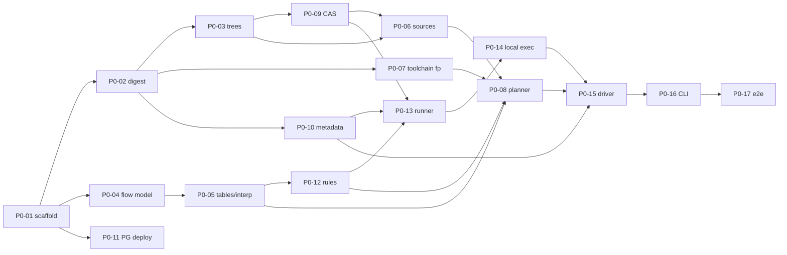

# Task index

Each file in this folder is one self-contained work item sized for one Claude Code session
(roughly 300–1,500 lines of code + tests). Run it with `/implement-task <ID>`.
Tasks in the same wave touch disjoint packages and can run in parallel in separate git worktrees
(`claude --worktree task/<ID>`); a task may start once every task in its "Depends on" line is `done`.

Status values: `todo` → `in-progress` → `review` → `done` (the human sets `done` after merging).

## Phase 0 — Foundations (exit: wrapped lint Makefile, 100 % cache hit on 2nd run)

| ID | Task | Depends on | Wave | Status |
| --- | --- | --- | --- | --- |
| P0-01 | Repository scaffold and quality gates | — | 1 | todo |
| P0-02 | Digests and canonical JSON | P0-01 | 2 | todo |
| P0-04 | Flow model, YAML loader, JSON Schema | P0-01 | 2 | todo |
| P0-11 | PostgreSQL deployment (compose, backups, pooling) | P0-01 | 2 | todo |
| P0-03 | Tree manifests | P0-02 | 3 | todo |
| P0-05 | Tables, matrix expansion, interpolation | P0-04 | 3 | todo |
| P0-07 | Toolchain fingerprint and env capture | P0-02 | 3 | todo |
| P0-10 | Metadata store (schema, PG, in-memory, contract suite) | P0-02 | 3 | todo |
| P0-09 | CAS filesystem backend | P0-03 | 4 | todo |
| P0-12 | Rule plugin API + `shell`, `make`, `tcl` rules | P0-05 | 4 | todo |
| P0-06 | Source snapshot and stat cache | P0-03, P0-09 | 5 | todo |
| P0-13 | Runner (local lifecycle) | P0-09, P0-10, P0-12 | 5 | todo |
| P0-08 | Planner, action keys, plan.json, plan diff | P0-05, P0-06, P0-07, P0-12 | 6 | todo |
| P0-14 | Executor API + local executor | P0-13 | 6 | todo |
| P0-15 | Driver / scheduler | P0-08, P0-10, P0-14 | 7 | todo |
| P0-16 | CLI: `plan`, `build`, `status`, `logs` | P0-15 | 8 | todo |
| P0-17 | Phase 0 end-to-end + examples | P0-16 | 9 | todo |

## Phase 1 — Grid + Questa (exit: full CPU regression on SLURM, minimal recompiles, no orphan scratch)

| ID | Task | Depends on | Wave | Status |
| --- | --- | --- | --- | --- |
| P1-01 | SLURM CLI adapter + FakeSlurm | P0-01 | 1 (can start during P0) | todo |
| P1-06 | Metadata HTTP service + client | P0-10 | 1 (can start during P0) | todo |
| P1-07 | Toolchain registration via modulefiles | P0-07, P0-10 | 1 | todo |
| P1-08 | Questa rule pack + fake Questa tools | P0-12 | 1 | todo |
| P1-11 | `ebs seeds gen` | P0-05 | 1 | todo |
| P1-02 | SLURM executor (sbatch, arrays, polling, cancel) | P1-01, P0-14 | 2 | todo |
| P1-04 | Runner on grid: materialization, debug collection, cleanup | P0-13, P1-06 | 2 | todo |
| P1-03 | Licenses, accounts/QOS, constraints | P1-02 | 3 | todo |
| P1-05 | Infra failure classification and retries | P1-02, P0-15 | 3 | todo |
| P1-09 | GC v1 (access tracking, pins, leases, sweep) | P0-09, P0-10, P0-15 | 3 | todo |
| P1-10 | `ebs debug` and `ebs reproduce` | P1-04, P0-16 | 4 | todo |
| P1-12 | Phase 1 acceptance on the grid | all P1 | 5 | todo |

## Phase 2 — Teams (exit: RTL release consumed by verification via flow.lock; `ebs tests <release>` correct)

| ID | Task | Depends on | Wave | Status |
| --- | --- | --- | --- | --- |
| P2-01 | Domains and authorization | P1-06 | 1 | todo |
| P2-02 | Releases and channels | P1-09 | 1 | todo |
| P2-05 | Metadata service hardening (OIDC, SSE, pagination) | P1-06 | 1 | todo |
| P2-03 | Imports and `flow.lock` | P2-02 | 2 | todo |
| P2-04 | Provenance queries (`why`, `used-by`, `tests`) | P2-02 | 2 | todo |
| P2-07 | GitLab CI integration (`--ci`, JUnit) | P2-02 | 2 | todo |
| P2-08 | `--detach` driver job | P1-02 | 2 | todo |
| P2-06 | Web dashboard v1 | P2-05, P2-04 | 3 | todo |
| P2-09 | Phase 2 acceptance | all P2 | 4 | todo |

## Phase 3 — Hermeticity and scale (exit: sandbox default for Questa; quarterly revalidation report)

| ID | Task | Depends on | Wave | Status |
| --- | --- | --- | --- | --- |
| P3-01 | bubblewrap sandbox (+ Apptainer fallback) | P1-04 | 1 | todo |
| P3-03 | SLSA attestations and signing | P2-02 | 1 | todo |
| P3-06 | Pilot worker pool | P1-02 | 1 | todo |
| P3-07 | S3 CAS backend | P0-09 | 1 | todo |
| P3-08 | FlexLM `LastConsumed` sync | P1-03 | 1 | todo |
| P3-02 | `ebs discover` (strace) | P3-01 | 2 | todo |
| P3-04 | Sign-off bundles and `ebs verify` | P3-03, P2-03 | 2 | todo |
| P3-05 | Revalidation jobs and comparators | P3-04 | 3 | todo |
| P3-09 | Phase 3 acceptance | all P3 | 4 | todo |

## Phase 4 — More flows

Backlog outlines in `phase-4-backlog.md`; they get full task files once phase 3 starts.

## Dependency graph (phase 0)

## Open decisions (defaults agents must use; the human confirms before the listed task)

| ID | Question | Default used until confirmed | Confirm before |
| --- | --- | --- | --- |
| D1 | How do runners/CLI authenticate to the metadata service? | MUNGE credential (`munge -n`) on cluster hosts, verified by the service with `unmunge`; bearer tokens for CI/web | P1-06 |
| D2 | Live log streaming path | Runner appends to `/debug/<domain>/<build>/<action>/live.log` (flushed every 5 s); `ebs logs -f` tails it | P1-04 |
| D3 | Public repo host / CI for the OSS project | GitLab CI config in-repo; GitHub mirror later | P0-01 |
| D4 | Release version format | Free-form string validated by regex `^[0-9A-Za-z][0-9A-Za-z._+-]{0,63}$`; docs recommend CalVer `YYYY.MM.N` | P2-02 |
| D5 | SLURM limits (MaxSubmitJobs, MaxArraySize, default partition/QOS per team) | All from `[slurm]` config; conservative defaults (array ≤ 1000, throttle 200) | P1-02 |
| D6 | Unprivileged user namespaces on compute nodes | Sandbox backend auto-detects; falls back to Apptainer, then to staging-only with a warning | P3-01 |
| D7 | NDA domains and NFS exports | Domains are config (`[[domains]]`), one CAS root per domain, created by an admin script | P2-01 |

Agents never resolve an open decision on their own: they implement the default behind a config
key or interface so it can change, and note it in the task's "Notes" section.

## Writing a new task

Copy `_TEMPLATE.md`. A good task names its files, its contracts (link to interfaces.md), numbered
requirements that are each testable, the test list mapped to requirements, what is out of scope,
and a final verification command.
